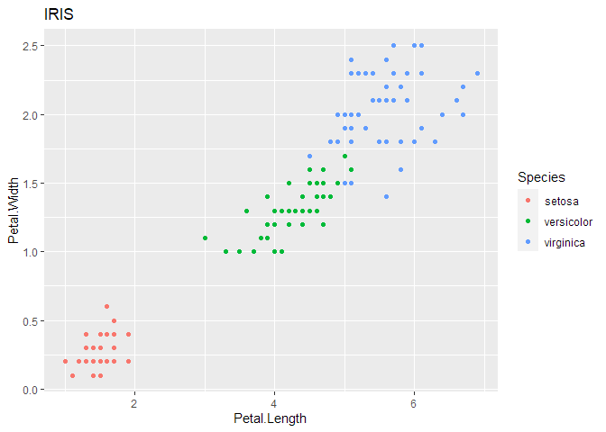
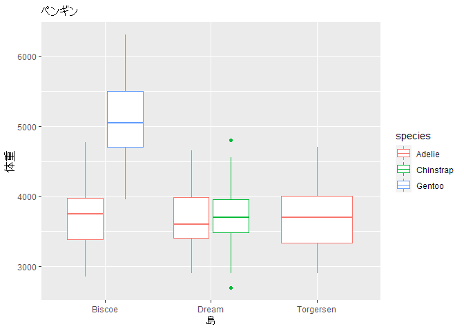

Quarto Demo
================
Yoshinobu Ishizaki
2022/05/17

-   <a href="#sec-top" id="toc-sec-top"><span
    class="toc-section-number">1</span> <span
    class="header-section-number">1</span> Quartoデモ</a>
-   <a href="#yaml" id="toc-yaml"><span class="toc-section-number">2</span>
    <span class="header-section-number">2</span> YAML</a>
-   <a href="#r-code" id="toc-r-code"><span
    class="toc-section-number">3</span> <span
    class="header-section-number">3</span> R Code</a>
-   <a href="#sec-math" id="toc-sec-math"><span
    class="toc-section-number">4</span> <span
    class="header-section-number">4</span> 数式</a>
-   <a href="#sec-figtab" id="toc-sec-figtab"><span
    class="toc-section-number">5</span> <span
    class="header-section-number">5</span> 図表</a>

## <span class="header-section-number">1</span> Quartoデモ

標準的なHTML文書出力のデモ。

<div>

> **Tip**
>
> デフォルトでこのような注記スタイルを持っている。

</div>

note, tip, important, caution, warningの5種類がある。詳しくは
<https://quarto.org/docs/authoring/callouts.html> 参照。

<div>

> **内容を見るにはここを開く**
>
> タイトルを付けて、最初はクローズした状態の物を作れる。
> クイズ等のインターフェースに使える。

</div>

図や表、数式、セクション等へ統一的な書式で相互参照を付けられる。

次節のプロットへの参照例: [図 1](#fig-iris) [図 3](#fig-mscat1)
[図 2](#fig-penguins)

数式への参照 : [式 1](#eq-euler) [式 3](#eq-mat)

節への参照: [セクション 5](#sec-figtab) [セクション 4](#sec-math)

## <span class="header-section-number">2</span> YAML

このファイルの先頭に記載してあるYAMLヘッダは次の通り。

    title: "Quarto Demo"
    author: "Yoshinobu Ishizaki"
    lang: ja
    date: last-modified
    date-formart: iso
    toc: true
    number-sections: true
    format: 
      html: 
        self-contained: true

`date: last-modified`とすることで、ファイルの変更日付がセットされる。

`date-format: iso`とすることで、YYYY-MM-DD形式で日付表示。

`self-contained: true`とすると図等をファイル内部に収めてHTMLファイルのみでどの場所でも再現できるようになる。
指定しないと、`filename_files/`フォルダ以下に図などが配置され、HTMLファイル本体のみでは正しく表示されなくなる。

`theme: slate`のように様々なテーマが使える。使えるテーマは<https://quarto.org/docs/output-formats/html-themes.html>を参照。

## <span class="header-section-number">3</span> R Code

``` r
library(tidyverse)
Sys.setlocale(locale = "japanese")
```

`Sys.setlocale()`を`.qmd`ファイルの中で呼んでおくと、Rが正しく日本語ファイルや文字を扱ってくれる。
`.Renviron`や`.Rprofile`で初期設定として呼ぶとQuartoの変換時にエラーが起こる。

``` r
iris %>% ggplot(aes(x = Petal.Length, y = Petal.Width, color = Species)) + 
  geom_point() + 
  labs(title = "IRIS")
```

<figure>

<figcaption aria-hidden="true">図 1: IRISプロット</figcaption>
</figure>

勿論日本語のタイトルや軸名も問題ない。

``` r
library(palmerpenguins)
```

``` r
penguins %>% 
  na.omit() %>% 
  ggplot(aes(x = island, y = body_mass_g, color = species)) + 
  geom_boxplot() + 
  labs(title = "ペンギン", x = "島", y = "体重")
```

<figure>

<figcaption aria-hidden="true">図 2: Palmer Penguines</figcaption>
</figure>

上記のプロットにて、以下のNAは予め除外した。

``` r
penguins %>% filter(is.na(body_mass_g)) %>% knitr::kable()
```

| species | island    | bill_length_mm | bill_depth_mm | flipper_length_mm | body_mass_g | sex | year |
|:--------|:----------|---------------:|--------------:|------------------:|------------:|:----|-----:|
| Adelie  | Torgersen |             NA |            NA |                NA |          NA | NA  | 2007 |
| Gentoo  | Biscoe    |             NA |            NA |                NA |          NA | NA  | 2009 |

## <span class="header-section-number">4</span> 数式

オイラーの公式

<span id="eq-euler">

```math
e^{i \pi} = -1
 \tag{1}
```
</span>

三角関数の公式

<span id="eq-trig">

```math
\begin{align}
\sin 2x & = 2 \sin x \cos x \\
\cos 2x & = \cos^2 x - \sin^2 x
\end{align}
 \tag{2}
```
</span>

行列表現

<span id="eq-mat">

```math
\begin{pmatrix}
a & b & c \\
d & e & f \\
g & h & i \\
\end{pmatrix}^{T} = 
\begin{pmatrix}
a & d & g \\
b & e & h \\
c & f & i 
\end{pmatrix}
 \tag{3}
```
</span>

## <span class="header-section-number">5</span> 図表

以下はMSOffice 付属の画像を使用した。

<figure>

<figcaption aria-hidden="true">図 3: MS Cat1</figcaption>
</figure>

<figure>

<figcaption aria-hidden="true">図 4: MS Cat2</figcaption>
</figure>

図のレイアウトを簡単に指定できる。上の図を2列に配置。

<div>

<table>
<colgroup>
<col style="width: 50%" />
<col style="width: 50%" />
</colgroup>
<tbody>
<tr class="odd">
<td style="text-align: center;"><div width="50.0%"
data-layout-align="center">
<figure>

<figcaption aria-hidden="true">MS Cat1</figcaption>
</figure>
</div></td>
<td style="text-align: center;"><div width="50.0%"
data-layout-align="center">
<figure>

<figcaption aria-hidden="true">MS Cat2</figcaption>
</figure>
</div></td>
</tr>
</tbody>
</table>

図 5: 列並びの図

</div>

Markdown形式の表にも参照が付けられる。

<div id="tbl-t1">

| 色  | 英語 | RGB    |
|-----|------|--------|
| 赤  | Red  | ff0000 |
| 青  | Blue | 0000ff |

表 1: 表サンプル

</div>

Rによる表にも同じように参照が付けられる。`kable`で囲む必要はある。

``` r
iris %>% head(10) %>% knitr::kable()
```

| Sepal.Length | Sepal.Width | Petal.Length | Petal.Width | Species |
|-------------:|------------:|-------------:|------------:|:--------|
|          5.1 |         3.5 |          1.4 |         0.2 | setosa  |
|          4.9 |         3.0 |          1.4 |         0.2 | setosa  |
|          4.7 |         3.2 |          1.3 |         0.2 | setosa  |
|          4.6 |         3.1 |          1.5 |         0.2 | setosa  |
|          5.0 |         3.6 |          1.4 |         0.2 | setosa  |
|          5.4 |         3.9 |          1.7 |         0.4 | setosa  |
|          4.6 |         3.4 |          1.4 |         0.3 | setosa  |
|          5.0 |         3.4 |          1.5 |         0.2 | setosa  |
|          4.4 |         2.9 |          1.4 |         0.2 | setosa  |
|          4.9 |         3.1 |          1.5 |         0.1 | setosa  |

[セクション 1](#sec-top)
に戻る(このような物を書かなくても、右にTOCが表示されているはずで、ナビゲートは簡単なはず)
