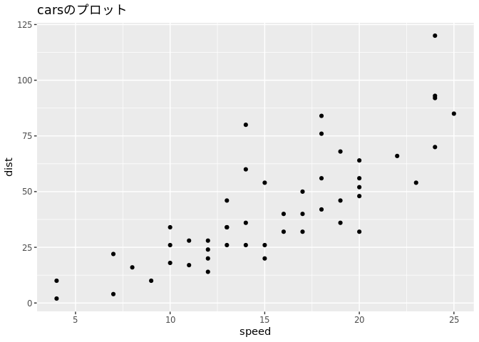

QMDファイルのテスト
================
Yoshinobu Ishizaki
2022-05-13

-   <a href="#テスト" id="toc-テスト"><span
    class="toc-section-number">1</span> <span
    class="header-section-number">1</span> テスト</a>
-   <a href="#数式" id="toc-数式"><span class="toc-section-number">2</span>
    <span class="header-section-number">2</span> 数式</a>

# <span class="header-section-number">1</span> テスト

これはQuartoの文書テスト。日本語がどの程度使えるのか。

→全く問題なく使用できる。

``` r
library(tidyverse)
```

    ── Attaching packages ─────────────────────────────────────── tidyverse 1.3.1 ──

    ✔ ggplot2 3.3.6     ✔ purrr   0.3.4
    ✔ tibble  3.1.7     ✔ dplyr   1.0.9
    ✔ tidyr   1.2.0     ✔ stringr 1.4.0
    ✔ readr   2.1.2     ✔ forcats 0.5.1

    ── Conflicts ────────────────────────────────────────── tidyverse_conflicts() ──
    ✖ dplyr::filter() masks stats::filter()
    ✖ dplyr::lag()    masks stats::lag()

``` r
cars %>% ggplot(aes(x = speed, y = dist)) + 
  geom_point() + 
  labs(title = "carsのプロット")
```



地の文もプロットタイトルも全く問題ない。

# <span class="header-section-number">2</span> 数式

markdown数式の各種亜種を気にすることなく表現出来るらしい。


